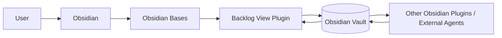
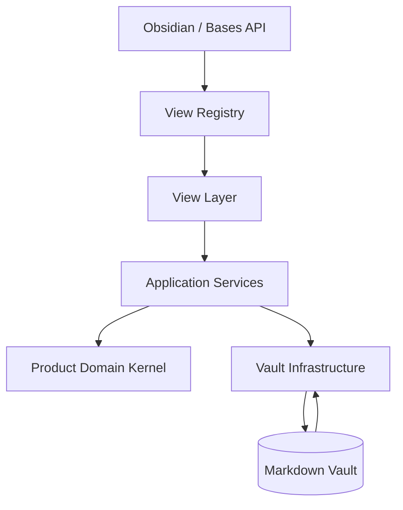
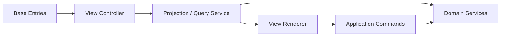
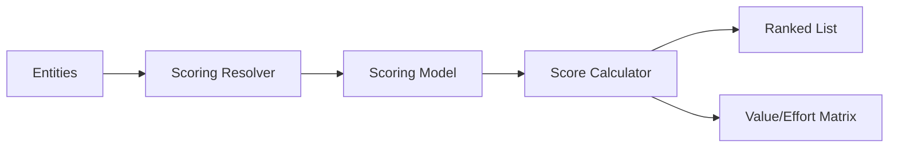
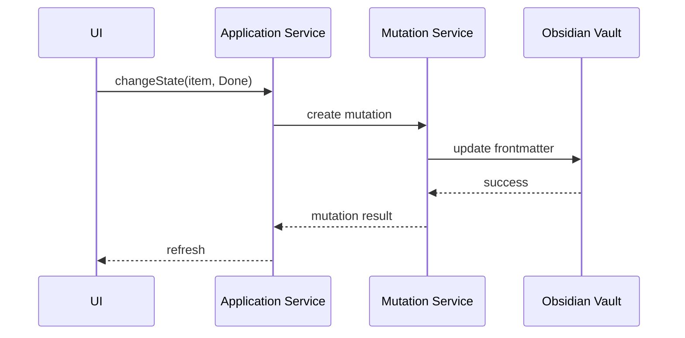
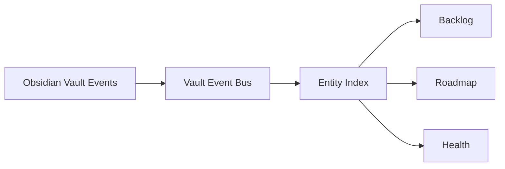
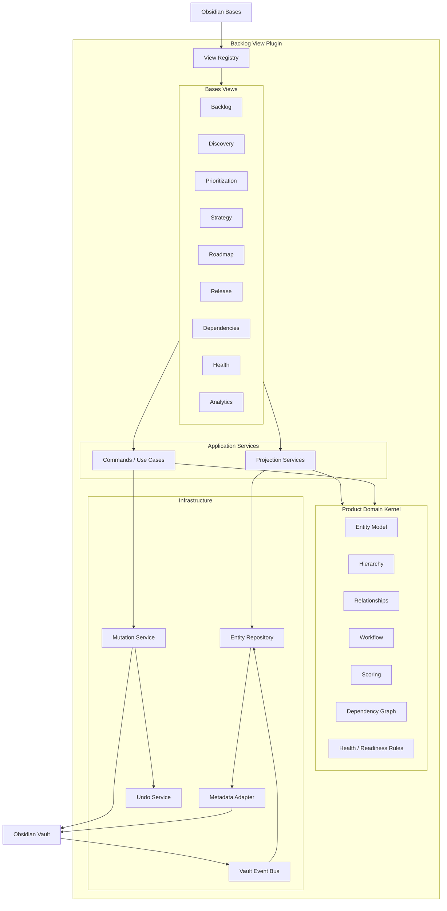

# SDD — Backlog View: modular product management views for Obsidian Bases

*Received 2026-08-16. Kept verbatim as the source the notes citing it were revisited
against. It describes a **proposed target architecture**: where it and the shipped
architecture disagree, the shipped one is what `npm run check` enforces and
the register's issue "The SDD's layers are not the four this repository
enforces" is where that is being settled — this document is not edited to agree with either.*

**Document type** — Software Design Document.
**Level** — High-level architecture.
**Product** — Backlog View.
**Platform** — Obsidian community plugin / Obsidian Bases.
**Status** — Proposed target architecture.

## 1. Purpose

This Software Design Document defines the target architecture for evolving Backlog View
from a single custom Obsidian Bases view into a modular suite of Product Management views.

The plugin will register multiple custom Bases view types while maintaining a shared
internal platform for entity interpretation, property access, hierarchy resolution,
relationships, workflow handling, scoring, validation, analytics, mutations, undo, and
shared UI components.

The central architectural principle is: **views are projections over a shared product model
derived entirely from the Obsidian vault.** The vault remains the persistent data store. No
proprietary database, remote service, or parallel source of truth shall be introduced.

## 2. Architectural goals

The architecture shall enable:

1. multiple independent Obsidian Bases view types from one plugin;
2. independent configuration for every view instance;
3. reuse of shared product-management logic across views;
4. Markdown and Obsidian properties as the source of truth;
5. safe modifications of vault data;
6. incremental introduction of new views;
7. graceful operation when optional properties are missing;
8. compatibility with user-defined product models;
9. maintainable boundaries between domain logic, Obsidian integration, and UI;
10. high testability without requiring a fully running Obsidian application for domain
    tests.

## 3. Architectural principles

**3.1 Local-first.** All persistent product information resides in the user's vault. The
plugin may maintain ephemeral in-memory indexes and caches, but these must always be
reconstructable from vault content.

**3.2 Vault as source of truth.** Persistent information is represented using Markdown
files, frontmatter properties, Obsidian links, file paths, folders and Bases definitions.
Internal state must never become authoritative over vault state.

**3.3 Views are projections.** A Bases view is not a separate domain:

```text
Feature.md
   │
   ├── Product Backlog View
   ├── Prioritization View
   ├── Strategy View
   ├── Roadmap View
   └── Health View
```

All views inspect the same Feature. They merely interpret or visualize different aspects of
it.

**3.4 Shared kernel, independent views.** Common semantics belong in reusable
application/domain services. Views should primarily be responsible for projection,
interaction, view-specific configuration and visualization. They must not independently
implement fundamental concepts such as hierarchy traversal or frontmatter mutation.

**3.5 Configuration over convention.** Reasonable defaults shall be provided. However,
users must be able to map concepts such as `status`, `parent`, `type`, `estimate`,
`objective`, `release`, `evidence` and `depends-on` to their own property names.

**3.6 Opt-in complexity.** Installing the plugin exposes all available Bases view types.
Users opt into a capability by adding that view to a Base. Using the Product Backlog must
not require configuring Strategy, Discovery, Releases, or other unrelated capabilities.

**3.7 Deterministic behaviour.** Product calculations and decisions made by the plugin must
be explainable and reproducible — priority scores, health checks, progress calculations,
readiness checks, hierarchy interpretation.

## 4. System context

Backlog View operates inside Obsidian.



Backlog View must tolerate vault content being modified externally. Possible writers include
the user, Obsidian itself, other plugins, Git, scripts, MCP clients and external agents. The
plugin must therefore not assume exclusive ownership of files.

## 5. Container architecture

At the highest level, the plugin consists of five architectural areas.



**5.1 View registry** — registers custom Bases view types: `product-backlog`,
`product-board`, `product-discovery`, `product-prioritization`, `product-strategy`,
`product-roadmap`, `product-release`, `product-dependencies`, `product-health`,
`product-analytics`, `product-decisions`.

**5.2 View layer** — visual projections and user interaction. Each view owns rendering,
view-specific options, commands, interaction patterns, empty states and local UI state.

**5.3 Application layer** — coordinates use cases: CreateItem, MoveItem, ChangeState,
CalculatePriority, PromoteOpportunity, AssignRelease, ResolveDependencies, EvaluateHealth,
CalculateProgress.

**5.4 Domain kernel** — product-management concepts independent from Obsidian rendering:
ProductEntity, EntityType, Hierarchy, Relationship, Workflow, ScoringModel, DependencyGraph,
Release, HealthRule, ReadinessRule.

**5.5 Infrastructure layer** — interaction with Obsidian APIs and physical Markdown data:
metadata cache, property reading, frontmatter writing, file creation, link resolution, Bases
entries, vault events, transactions, undo.

## 6. Proposed module structure

```text
src/
│
├── main.ts
│
├── plugin/
│   ├── ViewRegistry.ts
│   ├── CommandRegistry.ts
│   ├── PluginSettings.ts
│   └── lifecycle/
│
├── core/
│   ├── entities/
│   │   ├── ProductEntity.ts
│   │   ├── EntityType.ts
│   │   └── EntityRepository.ts
│   ├── properties/
│   │   ├── PropertyDefinition.ts
│   │   ├── PropertyMapping.ts
│   │   └── PropertyResolver.ts
│   ├── hierarchy/
│   │   ├── HierarchyModel.ts
│   │   ├── HierarchyResolver.ts
│   │   └── TreeBuilder.ts
│   ├── relationships/
│   │   ├── Relationship.ts
│   │   ├── RelationshipResolver.ts
│   │   └── RelationshipGraph.ts
│   ├── workflow/
│   │   ├── Workflow.ts
│   │   ├── WorkflowState.ts
│   │   └── ProgressCalculator.ts
│   ├── scoring/
│   │   ├── ScoringModel.ts
│   │   ├── ScoringDimension.ts
│   │   └── ScoreCalculator.ts
│   ├── dependencies/
│   │   ├── DependencyGraph.ts
│   │   └── DependencyAnalyzer.ts
│   ├── health/
│   │   ├── HealthRule.ts
│   │   ├── HealthEngine.ts
│   │   └── ReadinessEngine.ts
│   └── analytics/
│       ├── Aggregation.ts
│       ├── AgingCalculator.ts
│       └── CycleTimeCalculator.ts
│
├── application/
│   ├── backlog/ discovery/ prioritization/ strategy/ roadmap/
│   └── releases/ dependencies/ health/ analytics/
│
├── infrastructure/
│   ├── vault/
│   │   ├── ObsidianEntityRepository.ts
│   │   ├── VaultReader.ts
│   │   ├── VaultWriter.ts
│   │   └── FileFactory.ts
│   ├── metadata/
│   │   ├── MetadataAdapter.ts
│   │   └── LinkResolver.ts
│   ├── bases/
│   │   ├── BasesAdapter.ts
│   │   └── ViewConfigurationAdapter.ts
│   ├── events/
│   │   ├── VaultEventBus.ts
│   │   └── EntityChangeTracker.ts
│   └── mutations/
│       ├── MutationService.ts
│       ├── MutationBatch.ts
│       └── UndoService.ts
│
├── views/
│   ├── shared/
│   │   ├── components/ menus/ toolbar/ dialogs/ styles/
│   ├── backlog/ board/ discovery/ prioritization/ strategy/
│   ├── roadmap/ releases/ dependencies/ health/ analytics/
│   └── decisions/
│
└── tests/
    ├── unit/
    ├── integration/
    └── fixtures/
```

## 7. View registration

`main.ts` should remain primarily responsible for plugin composition:

```ts
class BacklogViewPlugin extends Plugin {
  async onload() {
    const services = createApplicationServices(this);
    registerBacklogView(this, services);
    registerBoardView(this, services);
    registerDiscoveryView(this, services);
    registerPrioritizationView(this, services);
    registerStrategyView(this, services);
    registerRoadmapView(this, services);
    registerReleaseView(this, services);
    registerDependencyView(this, services);
    registerHealthView(this, services);
    registerAnalyticsView(this, services);
    registerDecisionView(this, services);
  }
}
```

Each registration module owns only the registration of its Bases view type, for example
`views/prioritization/` holding `registerPrioritizationView.ts`, `PrioritizationView.ts`,
`PrioritizationController.ts`, `PrioritizationOptions.ts` and `components/`.

## 8. Shared product model

A generic internal representation should normalize a Markdown file for use by domain
services:

```ts
interface ProductEntity {
  id: string;
  filePath: string;
  title: string;
  type?: string;
  properties: Record<string, unknown>;
  links: EntityReference[];
  created?: Date;
  modified?: Date;
}
```

This entity is not persisted separately. It is reconstructed from Obsidian metadata.

## 9. Property mapping

Different users may use different names for the same concept — `state`, `status` and
`workflow-state` could all represent the semantic concept WorkflowState. A shared property
mapping layer therefore translates between the domain concept, the configured property and
the Markdown frontmatter:

```ts
interface ProductPropertyMap {
  type?: string;
  parent?: string;
  order?: string;
  state?: string;
  estimate?: string;
  objective?: string;
  evidence?: string;
  release?: string;
  milestone?: string;
  horizon?: string;
  startDate?: string;
  targetDate?: string;
  dependency?: string;
}
```

Each Bases view may override relevant mappings independently.

## 10. Configuration model

**10.1 Plugin-level settings** — reserved for genuinely global behavior: default property
suggestions, default created-item folder, diagnostic options, migration behavior. Global
settings should remain minimal.

**10.2 View-level settings** — most behavior belongs here:

```text
Prioritization View
valueProperty = business-value
effortProperty = effort
confidenceProperty = confidence
model = weighted-score
dimensions:
  - strategic-alignment
  - customer-value
  - risk-reduction
```

Another Prioritization view in the same Base may use a different model, allowing
configurations such as `Prioritization — Product Value`, `Prioritization — WSJF` and
`Prioritization — Compliance` without global conflicts.

## 11. View architecture



The renderer should not manipulate Markdown directly. Instead: UI → application command →
mutation service → vault adapter → Markdown.

## 12. Product Backlog view

The Product Backlog remains responsible for hierarchical management, depending on
HierarchyResolver, WorkflowService, ProgressCalculator, MutationService and
EntityRepository. Responsibilities: tree construction, hierarchy rendering, reordering,
re-parenting, work-item creation, progress rollups, workflow state management.

## 13. Board view

The workflow board may eventually become its own registered Bases view. Its domain model
remains the same as Product Backlog: backlog entities grouped by workflow state into kanban
columns. Drag operations translate into workflow-state mutations rather than hierarchy
changes.

## 14. Discovery view

Responsibilities: opportunity lifecycle, idea management, assumption tracking, validation,
promotion into backlog. Key services: DiscoveryService, RelationshipService, EntityFactory,
MutationService. Promotion should create or modify normal Markdown entities and establish
links.

## 15. Prioritization view

Responsibilities: scoring, ranking, comparison, matrices, scenarios.



Scoring models should remain deterministic pure domain logic wherever possible. This makes
them straightforward to unit test.

## 16. Strategy view

Responsibilities: objectives, outcomes, initiatives, JTBD, strategic alignment. The Strategy
view relies strongly on relationship traversal (`Objective → Outcome → Initiative → Epic →
Feature`). The underlying relationship engine should not assume that this particular
structure exists — the hierarchy shown is a configured projection.

## 17. Roadmap view

Responsibilities: horizon planning, temporal placement, roadmap grouping, milestones. Key
services: RoadmapProjectionService, DateResolver, RelationshipResolver, MutationService. The
roadmap intentionally avoids becoming a general scheduling engine.

## 18. Release view

Responsibilities: Release entities, release scope, capacity, readiness, scope scenarios.
Release information remains linked from normal Markdown entities, e.g.
`release: "[[Release 2.4]]"`.

## 19. Dependency view

The dependency engine should be implemented as a reusable graph model supporting dependency
traversal, transitive dependencies, reverse dependencies, cycle detection and blocked-state
calculation. The visual Dependency view merely renders this model.

## 20. Health engine

Backlog Health should use independent rules:

```ts
interface HealthRule {
  id: string;
  evaluate(
    entity: ProductEntity,
    context: HealthContext
  ): HealthFinding[];
}
```

Example rules: MissingParentRule, MissingEstimateRule, MissingObjectiveRule,
MissingEvidenceRule, StaleItemRule, InvalidHierarchyRule, CircularDependencyRule,
EmptyEpicRule. This enables rules to be independently tested, enabled/disabled, assigned
severities and reused by other views.

## 21. Readiness engine

Definition-of-Ready evaluation should use a similar rule mechanism — a ReadinessProfile of
HasDescription, HasEstimate, HasAcceptanceCriteria, HasDependencies, HasRequiredState.
Different views may define different profiles, e.g. Feature Definition of Ready versus
Release Readiness.

## 22. Analytics architecture

Analytics should be calculated from current vault state rather than persisted unless
technically required: backlog age, state distribution, throughput, cycle time, estimation
coverage, strategic coverage, evidence coverage. Analytics services should produce plain
data structures that UI views render.

## 23. Relationship engine

Relationships are central to the architecture — `parent`, `objective`, `evidence`,
`release`, `milestone`, `depends-on`, `decision`, `opportunity`, JTBD. A common resolver
should translate Obsidian links into resolved entities:

```ts
interface Relationship {
  source: EntityId;
  target: EntityId;
  type: RelationshipType;
}
```

This allows graph-oriented features without maintaining a graph database.

## 24. Repository abstraction

Domain and application services should not directly depend on `TFile`:

```ts
interface EntityRepository {
  find(id: EntityId): ProductEntity | undefined;
  findAll(): ProductEntity[];
  query(specification: EntitySpecification): ProductEntity[];
}
```

The Obsidian implementation adapts MetadataCache, Vault and Bases entries into the internal
model.

## 25. Mutation architecture



The mutation layer provides consistent file updates, validation, batching, undo metadata and
error reporting.

## 26. Mutation batching

Some operations affect multiple notes — bulk state update, reordering siblings, backfilling
properties, moving hierarchy, promoting discovery items. These should execute as logical
mutation batches, and a batch should either provide an undo record for the complete
operation or clearly report partial failure.

## 27. Undo

Undo must exist above raw file-writing calls. A mutation records before, after, affected file
and timestamp; a user action may contain multiple file mutations, so an undo action holds a
mutation batch. The design should preserve the current strong undo behavior of Backlog View
wherever practical.

## 28. Event handling

Because files may change outside the current view, Backlog View must respond to Obsidian
vault and metadata events: create, modify, delete, rename, metadata changed, Base
configuration changed.



Views should invalidate and refresh only what is necessary.

## 29. Entity index

For performance, the plugin may maintain a transient entity index: entity ID → ProductEntity,
type → entities, parent → children, relationship → targets. **The index is a cache, not
storage.** It must be possible to discard and rebuild it from the vault.

## 30. Shared UI components

Reusable user-interface primitives should live outside individual views: PropertyChip,
StateSelector, TagEditor, EntityPicker, RelationshipPicker, InlineNumberEditor, ContextMenu,
Toolbar, EmptyState, HealthBadge, ProgressIndicator, ScoreBadge, FilterControl. Views compose
these primitives instead of implementing independent variants.

## 31. Styling

The plugin should reuse Obsidian CSS variables wherever possible and avoid view-specific
design systems. Shared styles should support light theme, dark theme, community themes,
compact panes and wide panes. CSS should be component-scoped logically and avoid broad
selectors affecting the rest of Obsidian.

## 32. Error handling

**User/data errors** — invalid property, missing linked note, circular hierarchy,
unsupported property value. The user should receive actionable feedback.

**Recoverable technical errors** — file changed during mutation, metadata not yet refreshed,
link temporarily unresolved. The system may retry or refresh safely.

**Programming errors** — unexpected states should be logged with diagnostic information
while avoiding vault corruption.

## 33. Validation before mutation

Every write operation should follow: resolve → validate → plan mutation → write → verify →
refresh. Validation should occur before modifying files whenever possible.

## 34. Performance

The architecture should be optimized for vaults containing thousands of backlog-related
notes: avoid repeatedly scanning the entire vault during rendering; derive data from Base
entries where possible; maintain lightweight indexes; debounce high-frequency vault events;
calculate expensive projections lazily; avoid unnecessary DOM updates; cache graph traversals
where safe. Views should remain responsive when resizing, filtering, expanding trees, or
changing properties.

## 35. Security and privacy

Backlog View is local-first and does not inherently require network access, telemetry,
authentication or cloud storage. The plugin shall not transmit vault contents unless a future
explicit feature requires it. No such capability is part of this architecture.

## 36. Test architecture

**Unit tests** — domain logic: HierarchyResolver, ScoreCalculator, ProgressCalculator,
DependencyAnalyzer, HealthRules, ReadinessRules, Analytics. These tests should not require
Obsidian.

**Integration tests** — frontmatter reading, frontmatter writing, link resolution, mutation
batching, entity mapping, configuration parsing, using adapters or test fixtures.

**View tests** — view projection logic independently from the full Obsidian shell where
feasible.

**End-to-end tests** — a smaller suite verifying critical interactions against Obsidian:
create backlog item, move item, change state, add Prioritization view, configure scoring,
assign release, undo change.

## 37. Dependency direction

Dependency direction must remain inward: views → application → domain; infrastructure →
application/domain abstractions. The domain must not import Obsidian APIs, DOM APIs or Bases
UI classes. This is essential for testability and long-term maintainability.

## 38. Target C4 component view



## 39. Migration from current architecture

The current Backlog View should not be rewritten from scratch. Migration should happen
incrementally.

**Phase 1 — extract shared kernel.** Extract existing logic for properties, hierarchy,
workflow, progress, mutations and undo without changing visible behavior.

**Phase 2 — establish view registry.** Refactor registration so multiple Bases views can be
registered cleanly. Existing Product Backlog remains the first view.

**Phase 3 — extract existing projections.** Potentially extract Kanban → workflow board
view, roadmap → roadmap view, Deliverables → dedicated view if justified, while maintaining
migration compatibility.

**Phase 4 — add new views**, in the order Prioritization, Health, Discovery, Strategy,
Release, Dependencies, Analytics, Decisions. Each new view should reuse the shared kernel
rather than introduce parallel domain implementations.

## 40. Architectural decision summary

| Decision | Choice |
| --- | --- |
| Persistence | Markdown + frontmatter |
| Database | None |
| Main integration surface | Obsidian Bases |
| Product architecture | Multiple custom Bases views |
| View configuration | Per view instance |
| Domain model | Shared internal product kernel |
| Cross-view communication | Vault data |
| Relationships | Obsidian links |
| Caching | Ephemeral |
| Mutation handling | Centralized |
| Undo | Mutation-batch based |
| Network dependency | None |
| AI layer | None |
| Scheduling engine | Out of scope |
| Generic PM suite | Out of scope |

## 41. Architectural fitness criteria

The architecture should be considered successful if the following remain true as
functionality grows:

- adding a new view does not require modifying unrelated views;
- domain functionality can be unit-tested without Obsidian;
- the same Feature note can participate in several views without data duplication;
- users can configure two instances of the same view differently;
- removing the plugin leaves all meaningful product information intact;
- rebuilding all internal caches from the vault produces the same product model;
- writes performed by external tools become visible after normal vault events;
- one broken or misconfigured view does not prevent other views from functioning;
- common operations such as property mutation are implemented once;
- view-specific settings remain isolated from unrelated views.

## 42. Target architecture principle

```text
Backlog View Plugin
        │
        ├── Shared Product Management Kernel
        │
        ├── Obsidian/Vault Infrastructure
        │
        └── Modular Bases Projections
                │
                ├── Backlog
                ├── Board
                ├── Discovery
                ├── Prioritization
                ├── Strategy
                ├── Roadmap
                ├── Releases
                ├── Dependencies
                ├── Health
                ├── Analytics
                └── Decisions
```

**The product model is not the views.** The product model is the connected set of Markdown
entities and properties in the vault. The views are specialized lenses through which users
interact with that model.

This distinction is the core architectural foundation for scaling Backlog View from one
useful Bases extension into a coherent Product Management toolkit without turning it into a
monolithic application.
